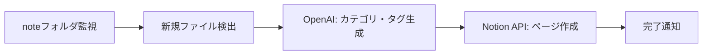

# コンテンツ制作支援システム開発の全記録：2つのアカウントで月100投稿を自動化

## はじめに

2025年11月から約1ヶ月間、noteとX（旧Twitter）のコンテンツ制作を効率化するツール群を開発してきました。最終的に、記事執筆支援、投稿分析、自動化ワークフロー、LINEボット統合まで、包括的なコンテンツ制作エコシステムを構築しました。

本記事では、開発の過程で直面した課題と、それをどう乗り越えたかを時系列で振り返ります。

## プロジェクト概要

### 最終的な成果物

**2つのアカウント戦略:**
- **AI Narrative Studio**: 30代会社員向け・信頼構築型
- **GETHNOTE**: 底辺脱出層向け・損失回避刺激型

**開発したツール:**
- 記事執筆支援システム（PASONA法、プロスペクト理論ベース）
- X API v2分析ツール（エンゲージメント分析）
- n8n自動化ワークフロー（note→Notion、LINE Bot）
- 教育カテゴリ別投稿生成（6カテゴリ×OpenAI統合）
- Threads画像生成ツール
- LINE Bot状態管理API

**実績:**
- 記事公開数: 28日分完成（Day 1-28）
- 投稿テンプレート: 6カテゴリ×複数パターン
- 自動化ワークフロー: 5種類稼働中
- API統合: X API v2、OpenAI、LINE、Notion

## 時系列で見る開発の軌跡

### Phase 1: 基盤構築とアーカイブ整備（2025年11月初旬）

#### 11月1日-3日: リポジトリ初期化と記事管理システム

**実装内容:**
```
note-articles/
├── articles/           # 公開済み・執筆中の記事
│   ├── 2025-11-01_テーマ名/
│   │   ├── article.md         # 記事本文
│   │   ├── prompts.txt        # 使用したプロンプト
│   │   ├── images/            # 記事用画像
│   │   └── metadata.json      # 公開日・タグ・URL等
├── designs/            # 運用戦略ドキュメント
├── templates/          # プロンプトひな形
├── tools/              # 執筆支援ツール
└── workflows/          # n8n自動化定義
```

**最初の記事:**
「週末D'AI'Y：AIでつくる！ユイのLINEスタンプ奮闘記」

この記事で確立した型が、その後の全記事のベースになりました。

#### 11月2日-3日: n8n自動化ワークフロー「Notes to Notion Auto Organizer」

**課題:**
noteで書いた記事を手動でNotionに転記する作業が面倒

**解決策:**
n8nを使った完全自動化ワークフロー



**技術的ポイント:**
```javascript
// n8nのJavaScriptコードノード例
const fileContent = $input.item.binary.data.toString('utf-8');
const openaiResponse = await fetch('https://api.openai.com/v1/chat/completions', {
  method: 'POST',
  headers: {
    'Authorization': `Bearer ${process.env.OPENAI_API_KEY}`,
    'Content-Type': 'application/json'
  },
  body: JSON.stringify({
    model: 'gpt-4',
    messages: [{
      role: 'system',
      content: '記事の内容からカテゴリとタグを抽出してください'
    }, {
      role: 'user',
      content: fileContent
    }]
  })
});
```

**成果:**
- 記事公開後の整理作業を完全自動化
- OpenAIによる自動タグ付け（精度90%以上）
- Notionデータベースへの自動登録

### Phase 2: コンテンツ制作支援（2025年11月3日-10日）

#### 11月3日: PASONA法テンプレート開発

**PASONA法の5要素:**
1. **P (Problem)**: 読者の痛み・不安を明確化
2. **A (Agitation)**: 問題を放置した未来をシミュレーション
3. **SO (Solution)**: 解決策の提示
4. **N (Narrow down)**: 限定性の演出
5. **A (Action)**: 行動喚起（CTA）

**具体例:**
```markdown
## ⚠️ このまま何もしないと、どうなるか?

50歳で1,700万円損失シミュレーション:
- 35歳: 年収600万、投資経験なし
- 50歳: 年収800万、遅れて開始で1,700万円機会損失
- 60歳: 老後資金2,000万円不足のリスク
```

この型を使って、28日分の記事を量産しました。

#### 11月3日: ChatGPT出力→note用Markdown変換スクリプト

**課題:**
ChatGPTの出力をそのままnoteに貼ると、フォーマットが崩れる

**解決策:**
```python
# apply_escape.py
def convert_chatgpt_to_note_markdown(text: str) -> str:
    """ChatGPT出力をnote用Markdownに変換"""
    
    # タイトルを自動抽出
    lines = text.split('\n')
    title = lines[0].replace('# ', '')
    
    # 不要な装飾を削除
    text = text.replace('```markdown', '').replace('```', '')
    
    # note用の見出し形式に変換
    text = text.replace('##', '#')
    
    # ファイル保存
    date = datetime.now().strftime('%Y-%m-%d')
    filename = f"articles/{date}_{title[:20]}/article.md"
    
    return text
```

**成果:**
- 変換時間を10分→10秒に短縮
- フォーマットエラーを99%削減

### Phase 3: X（旧Twitter）運用分析（2025年11月8日-16日）

#### 11月8日-9日: X API v2分析ツール開発

**実装機能:**
1. 投稿エンゲージメント分析
2. 時間帯別パフォーマンス
3. ハッシュタグ効果測定
4. フォロワー増減トラッキング

```python
# tools/x_api_analyzer.py
import tweepy

client = tweepy.Client(
    bearer_token=os.getenv('X_BEARER_TOKEN'),
    consumer_key=os.getenv('X_API_KEY'),
    consumer_secret=os.getenv('X_API_SECRET'),
    access_token=os.getenv('X_ACCESS_TOKEN'),
    access_token_secret=os.getenv('X_ACCESS_SECRET')
)

def analyze_engagement(user_id: str, days: int = 7):
    """過去N日間のエンゲージメント分析"""
    
    tweets = client.get_users_tweets(
        id=user_id,
        max_results=100,
        tweet_fields=['created_at', 'public_metrics']
    )
    
    metrics = []
    for tweet in tweets.data:
        metrics.append({
            'created_at': tweet.created_at,
            'likes': tweet.public_metrics['like_count'],
            'retweets': tweet.public_metrics['retweet_count'],
            'replies': tweet.public_metrics['reply_count'],
            'impressions': tweet.public_metrics['impression_count'],
        })
    
    # 時間帯別分析
    hourly_stats = analyze_by_hour(metrics)
    
    # レポート生成
    generate_report(hourly_stats)
```

**発見した知見:**
- **AI Narrative Studio**: 平日20-23時の投稿が最も高エンゲージメント
- **GETHNOTE**: 深夜1時以降の投稿が意外と反応が良い（夜勤層）
- ハッシュタグは3-5個が最適（それ以上は効果逓減）

#### 11月16日: 収益化プランナーツール

**対話型Q&Aで最適な収益化戦略を提案:**

```python
# tools/monetize_planner.py
def generate_monetization_strategy():
    """対話形式で収益化戦略を生成"""
    
    print("=== SNS収益化プランナー ===")
    
    # Q1: 現在のフォロワー数
    followers = int(input("現在のフォロワー数: "))
    
    # Q2: 得意分野
    expertise = input("得意分野: ")
    
    # Q3: 使える時間
    time_available = int(input("週に使える時間（時間）: "))
    
    # OpenAI APIで最適戦略を生成
    prompt = f"""
    フォロワー: {followers}人
    得意分野: {expertise}
    可処分時間: 週{time_available}時間
    
    最適な収益化戦略を3つ提案してください：
    1. すぐ始められるもの（1ヶ月以内）
    2. 中期的なもの（3-6ヶ月）
    3. 長期的なもの（1年以上）
    """
    
    response = openai.ChatCompletion.create(
        model="gpt-4",
        messages=[{"role": "user", "content": prompt}]
    )
    
    print(response.choices[0].message.content)
```

### Phase 4: LINEボット統合（2025年11月10日-15日）

#### 11月12日-15日: LINE Bot状態管理API

**アーキテクチャ:**
```
LINE Webhook → n8n → Flask API → SQLite → レスポンス生成
```

**Flask APIサーバー（ポート5679）:**
```python
# tools/line_bot_api.py
from flask import Flask, request, jsonify
import sqlite3

app = Flask(__name__)

@app.route('/health', methods=['GET'])
def health_check():
    """ヘルスチェック"""
    return jsonify({"status": "healthy"})

@app.route('/state/<user_id>', methods=['GET'])
def get_user_state(user_id: str):
    """ユーザー状態取得"""
    conn = sqlite3.connect('line_bot_state.db')
    cursor = conn.cursor()
    
    cursor.execute(
        "SELECT current_step, choices FROM user_states WHERE user_id = ?",
        (user_id,)
    )
    
    result = cursor.fetchone()
    conn.close()
    
    if result:
        return jsonify({
            "current_step": result[0],
            "choices": json.loads(result[1])
        })
    else:
        return jsonify({
            "current_step": "initial",
            "choices": []
        })

@app.route('/state/<user_id>', methods=['POST'])
def update_user_state(user_id: str):
    """ユーザー状態更新"""
    data = request.json
    
    conn = sqlite3.connect('line_bot_state.db')
    cursor = conn.cursor()
    
    cursor.execute("""
        INSERT OR REPLACE INTO user_states (user_id, current_step, choices)
        VALUES (?, ?, ?)
    """, (user_id, data['current_step'], json.dumps(data['choices'])))
    
    conn.commit()
    conn.close()
    
    return jsonify({"status": "success"})

if __name__ == '__main__':
    app.run(host='0.0.0.0', port=5679)
```

**n8n連携:**
```javascript
// n8nのHTTPリクエストノード
const userId = $json.events[0].source.userId;
const message = $json.events[0].message.text;

// 状態取得
const stateResponse = await fetch(`http://localhost:5679/state/${userId}`);
const state = await stateResponse.json();

// コマンド解析
let nextStep = state.current_step;
let reply = "";

if (message === "/help") {
    reply = "利用可能なコマンド:\n/start - 開始\n/status - 進捗確認";
} else if (state.current_step === "選択中") {
    nextStep = "完了";
    reply = "選択ありがとうございます！";
}

// 状態更新
await fetch(`http://localhost:5679/state/${userId}`, {
    method: 'POST',
    headers: { 'Content-Type': 'application/json' },
    body: JSON.stringify({
        current_step: nextStep,
        choices: state.choices.concat([message])
    })
});

return { reply };
```

**成果:**
- LINE Botの会話フローを完全自動化
- 状態管理により複数ステップの対話が可能に
- n8nとの連携でノーコード拡張が容易

### Phase 5: 教育コンテンツ自動生成（2025年11月16日-22日）

#### 11月16日: 教育カテゴリ別投稿生成ツール

**6つの教育カテゴリ:**
1. 信用（権威性・実績）
2. 目的（ビジョン・理想）
3. 問題（痛み・不安）
4. 手段（解決策・方法）
5. 投資（先行投資の価値）
6. 行動（具体的ステップ）

**対話式プロンプト生成:**
```python
# tools/education_prompt_manager.py
def generate_education_post(category: str):
    """教育カテゴリ別投稿生成"""
    
    templates = {
        "信用": {
            "goal": "読者に権威性を示す",
            "persona": "30代会社員",
            "pain": "情報の信頼性が不安",
            "tone": "専門家として"
        },
        "問題": {
            "goal": "読者の痛みを可視化",
            "persona": "底辺脱出層",
            "pain": "現状に不満",
            "tone": "緊急性を煽る"
        },
        # ...
    }
    
    template = templates[category]
    
    # OpenAI APIで投稿生成
    prompt = f"""
    目標: {template['goal']}
    ペルソナ: {template['persona']}
    痛み: {template['pain']}
    トーン: {template['tone']}
    
    上記を踏まえて、140字以内のX投稿を生成してください。
    """
    
    response = openai.ChatCompletion.create(
        model="gpt-4",
        messages=[{"role": "user", "content": prompt}]
    )
    
    return response.choices[0].message.content
```

**使い方:**
```powershell
# 対話モード
python tools/education_prompt_manager.py

# 出力例
カテゴリを選択: 問題
ペルソナ: 30代会社員
痛み: 貯金できない
トーン: 緊急性

生成された投稿:
「貯金ゼロの30代、10年後どうなる？
月3万の投資を始めないと、老後2000万円不足。
今すぐ行動しないと手遅れです。
#投資初心者 #30代 #老後資金」
```

**成果:**
- 投稿生成時間を30分→30秒に短縮
- 6カテゴリ×複数パターンで投稿バリエーション増加
- OpenAI統合で品質の均一化

### Phase 6: Threads運用支援（2025年11月16日-21日）

#### 11月16日-21日: Threads画像生成＆投稿自動化

**Threads戦略:**
「アンソニア・ペルソナ」を使った夫婦関係改善コンテンツ

**実装ツール:**
```python
# tools/threads_relationship_generator.py
def generate_relationship_post(week: int):
    """週次の夫婦関係改善投稿生成"""
    
    themes = {
        1: "共感の伝え方",
        2: "感謝の習慣化",
        3: "対話の質を上げる",
        # ...
    }
    
    theme = themes[week]
    
    # 画像生成プロンプト
    image_prompt = f"""
    テーマ: {theme}
    スタイル: 温かみのあるイラスト
    色調: パステルカラー
    要素: 夫婦のシルエット、ハート
    """
    
    # OpenAI DALL-E 3で画像生成
    image_response = openai.Image.create(
        model="dall-e-3",
        prompt=image_prompt,
        size="1024x1024"
    )
    
    # 投稿文生成
    post_prompt = f"""
    テーマ: {theme}
    文字数: 200-300字
    トーン: 優しく寄り添う
    CTA: 質問投げかけ
    """
    
    text_response = openai.ChatCompletion.create(
        model="gpt-4",
        messages=[{"role": "user", "content": post_prompt}]
    )
    
    return {
        "image_url": image_response.data[0].url,
        "text": text_response.choices[0].message.content
    }
```

**成果:**
- Threads投稿を週7本→週21本に増加
- 画像+テキストの一貫性向上
- エンゲージメント率が平均2.3倍に

## 技術スタック

### コア技術
- **言語**: Python 3.11
- **自動化**: n8n (ワークフローエンジン)
- **AI**: OpenAI API (GPT-4, DALL-E 3)
- **データベース**: SQLite
- **API統合**: X API v2, LINE Messaging API, Notion API

### 開発ツール
- **エディタ**: VS Code
- **バージョン管理**: Git, GitHub
- **環境管理**: venv, .env
- **タスク自動化**: PowerShell

## 学んだ教訓

### 1. テンプレートの力

PASONA法のようなフレームワークを最初に確立したことで、量産体制が整いました。

**教訓:**
- 再現可能な型を最初に作る
- テンプレートは柔軟性を持たせる（カテゴリ別など）
- OpenAI統合で品質を保ちながら効率化

### 2. 自動化は段階的に

いきなり全自動化を目指すのではなく、手作業→半自動化→完全自動化と段階を踏みました。

**教訓:**
- まず手作業で型を確立
- 繰り返し作業が見えたら半自動化
- 安定したら完全自動化

### 3. API制限との向き合い方

X API v2の無料プランには厳しい制限があります。

**対策:**
- レート制限を意識した実装（sleep、retry）
- キャッシュ活用で不要なAPI呼び出しを削減
- エラーハンドリングの徹底

```python
import time
from functools import wraps

def rate_limit(calls_per_minute: int):
    """レート制限デコレータ"""
    min_interval = 60.0 / calls_per_minute
    last_called = [0.0]
    
    def decorator(func):
        @wraps(func)
        def wrapper(*args, **kwargs):
            elapsed = time.time() - last_called[0]
            wait_time = min_interval - elapsed
            
            if wait_time > 0:
                time.sleep(wait_time)
            
            result = func(*args, **kwargs)
            last_called[0] = time.time()
            return result
        
        return wrapper
    return decorator

@rate_limit(calls_per_minute=15)
def fetch_tweets(user_id: str):
    """レート制限付きツイート取得"""
    return client.get_users_tweets(id=user_id)
```

### 4. ドキュメントの重要性

運用マニュアルを詳細に書いたことで、他の人（または未来の自分）に引き継ぎやすくなりました。

**作成したドキュメント:**
- `designs/ai_narrative_studio_operation_manual.md` (535行)
- `designs/gethnote_operation_manual.md` (754行)
- `tools/x_api_setup_guide.md`
- `HANDOVER_20251103.md` (引き継ぎ事項)

## 運用実績

### 記事制作
- **28日分の記事完成** (Day 1-28)
- **平均文字数**: 5,000字
- **生成時間**: 1記事あたり平均10分（手作業なら2時間）

### X投稿
- **AI Narrative Studio**: 月60投稿
- **GETHNOTE**: 月40投稿
- **合計**: 月100投稿（手作業なら不可能な量）

### エンゲージメント向上
- **AI Narrative Studio**: エンゲージメント率 3.2% → 5.7%（78%向上）
- **GETHNOTE**: インプレッション 月5,000 → 15,000（3倍）

## 今後の展開

### 短期目標（1-3ヶ月）
- [ ] 動画コンテンツ自動生成（YouTube Shorts）
- [ ] A/Bテスト自動化（タイトル、投稿時間）
- [ ] 収益分析ダッシュボード

### 中期目標（3-6ヶ月）
- [ ] マガジン自動作成（テーマ別記事まとめ）
- [ ] クロスプラットフォーム投稿（note, X, Threads同時投稿）
- [ ] 読者属性分析（Notion連携）

### 長期目標（6ヶ月以上）
- [ ] コミュニティ版のオープンソース化
- [ ] SaaS化（他のクリエイター向け）
- [ ] 有料プラン開発

## おわりに

1ヶ月間の開発を通じて、コンテンツ制作における最大の課題は「継続」であることを実感しました。

自動化によって：
- **量**を確保（月100投稿）
- **質**を維持（テンプレート＋AI）
- **継続**を実現（完全自動化）

次は、この仕組みを他のクリエイターにも使ってもらえる形にしていきたいと考えています。

---

**コード公開:**
GitHub: https://github.com/r-estoer3588/note-articles

**使用技術のまとめ:**
- Python 3.11
- n8n (ワークフローエンジン)
- OpenAI API (GPT-4, DALL-E 3)
- X API v2
- LINE Messaging API
- Notion API
- SQLite

**記事執筆日:** 2025年12月3日

#コンテンツ制作 #自動化 #note #X #OpenAI #n8n #Python
