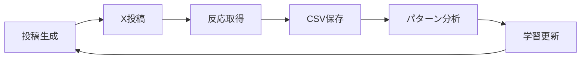

# ホゲーアルゴリズム

泥人間ペルソナ向けX投稿自動生成システム

## 概要

**ホゲーアルゴリズム**は、「仕事や家事に疲れ、ビール2本飲んで寝る前にホゲーっとXを眺めるだけのモチベ0知識0の泥人間」をターゲットにした、X投稿自動生成＋自律学習システムです。

### 主な特徴

- **6つの教育タイプ**: 目的・問題・価値・信頼・親近感・行動
- **8テンプレ構造**: 感情爆発型、自虐型、ストーリー型、教師型など
- **バズ構成**: 1万〜10万いいねを狙える7行構成
- **3部作ストーリー**: 起→転→解の追いたくなる投稿
- **CSV学習**: 自分の投稿＋強者アカウントから学習
- **自律型改善**: 反応データで自動最適化

## インストール

```bash
cd c:\Repos\note-articles\tools
pip install pandas
```

## 使い方

### 基本的な使い方

```python
from hogey_algorithm import HogeyAlgorithm

# インスタンス作成
hogey = HogeyAlgorithm()

# バズ投稿を1つ生成
post = hogey.generate_buzz_post(theme="貧乏脱出")
print(post['text'])

# 3部作ストーリー生成
trilogy = hogey.generate_story_trilogy(theme="停滞からの逆転")
for p in trilogy['posts']:
    print(f"{p['part']}: {p['text']}")

# 一括生成（10件）
df = hogey.generate_posts_batch(count=10, theme="人生逆転")
hogey.save_posts_csv(df, 'output_posts.csv')
```

### CSV学習を使う

#### 1. CSVデータを準備

**自分の投稿CSV** (`my_posts.csv`)
```csv
post_id,text,datetime,likes,retweets,comments,hashtags
1,"残高274円の夜...",2025-01-01 20:00,150,30,5,#げすいぬ
```

**強者アカウント投稿CSV** (`bench_posts.csv`)
```csv
account_name,text,datetime,likes,retweets,comments
@example,"成功者の投稿...",2025-01-01 19:00,5000,800,100
```

#### 2. 学習実行

```python
hogey = HogeyAlgorithm()

# CSV学習
hogey.learn_from_csv(
    my_posts_path='my_posts.csv',
    bench_posts_path='bench_posts.csv'
)

# 学習済みパターンで生成
post = hogey.generate_buzz_post(theme="貧乏脱出")
```

## 投稿構造

### バズ投稿（7行構成）

```
1-2行目: 起承（共感フック）
  → 泥人間の日常を描く
  例: "ホゲーっと生きてる。気づいたら何も変わってない。"

3-4行目: 転結（問題提起・気づき）
  → 「でもある日...」で転機を示す
  例: "でもある日、「このままじゃ終われない」って思った。"

5-6行目: 応用（具体策・ストーリー）
  → 変化の過程を描く
  例: "あの時から少しずつ変えた。人生が動き出した。"

7行目: 独創的な締め
  → 希望・行動誘導・余韻
  例: "試してみて。"
```

### 3部作ストーリー

1. **起（共感・導入）**: 読者が「俺もそうだった」と思う瞬間
2. **転（崩壊・気づき）**: 心が動く違和感や気づき
3. **解（逆転・希望）**: 「変われる」と思わせる希望

## n8n連携

### ワークフロー構成

```
1. [Webhook] テーマ受信
2. [Python] hogey_algorithm.py実行
3. [生成] 投稿テキスト出力
4. [LINE通知] 下書き送信
5. [X投稿] 自動投稿（オプション）
6. [反応取得] いいね・リツイート数取得
7. [CSV保存] 学習データ蓄積
8. [自動学習] パターン更新
```

### n8nノード設定例

#### Execute Commandノード

```json
{
  "command": "python",
  "arguments": [
    "c:\\Repos\\note-articles\\tools\\hogey_algorithm.py"
  ],
  "cwd": "c:\\Repos\\note-articles\\tools"
}
```

#### Webhookノード（入力）

```json
{
  "path": "hogey-generate",
  "method": "POST",
  "responseMode": "lastNode"
}
```

リクエストボディ例:
```json
{
  "theme": "貧乏脱出",
  "count": 5,
  "type": "buzz"
}
```

## 学習ループ



### 自律改善の仕組み

1. 投稿の反応（いいね・リツイート）を取得
2. 高反応投稿の語尾・フック・構成を抽出
3. 次回生成時に優先的に使用
4. 定期的に強者アカウントCSVも更新してトレンド反映

## 出力例

### バズ投稿

```
ホゲーっと生きてる。
気づいたら何も変わってない。

でもある日、「このままじゃ終われない」って思った。

あの時から少しずつ変えた。
情報に金を払うようにして、人生が動き出した。

試してみて。
```

### 3部作ストーリー

**① 起**
```
夜中2時。
冷めたカップ麺すすりながら、
Xで他人の成功話見てた。

何も変わらんまま、
明日も同じ朝が来ると思ってた。
```

**② 転**
```
でもある日、上司が笑いながら言った。
「お前、夢とかないの？」

頭の中が真っ白になった。
あの瞬間、「このままじゃ終われない」って思った。
```

**③ 解**
```
あの時から少しずつ変えた。
情報に金を払うようにして、
気づけば人生が静かに動き出した。

泥の中でも、足を動かせば沈まない。
そろそろ浮上しようぜ。
```

## カスタマイズ

### フックワードの追加

```python
hogey.learned_patterns['hooks'].append("新しいフック")
```

### 語尾の追加

```python
hogey.learned_patterns['endings'].append("新しい語尾")
```

### 固有名詞の追加

```python
hogey.learned_patterns['nouns'].append("新ツール名")
```

## トラブルシューティング

### CSVが読み込めない

- エンコーディングを確認（UTF-8 BOM付き推奨）
- 列名が正しいか確認（text, likes, retweetsなど）

### 投稿が生成されない

- pandasがインストールされているか確認
- Pythonバージョン3.8以上を使用

## ライセンス

このプロジェクトは個人利用向けです。

## クレジット

開発: げすいぬくん | 底辺脱出マガジン
X: @gethinu

---

**ホゲーっと生きてる暇はない。今すぐ動け。**
